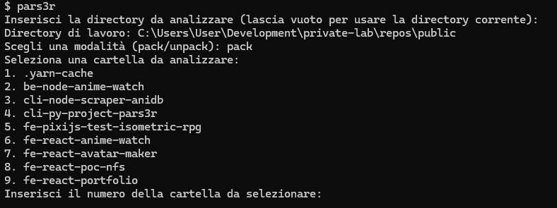
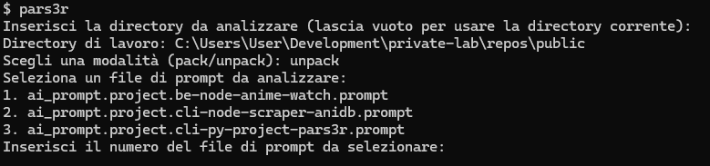

# **cli-py-project-pars3r**

<p align="center">
  
</p>

[](./LICENSE)
[](#)


A Python CLI tool designed not just to parse and restore project structures, but to simplify the creation of complex input prompts for Large Language Models (LLMs). With `CLI-Py-Project-Pars3r`, you can bundle an entire project—its files, directories, and their contents—into a single `.prompt` file, making it simpler to feed elaborate and fully contextualized information into LLM-based workflows.

This ensures that your LLM can receive all the context it needs in one go, without manual copying or multiple incremental inputs.

<p align="center">
  
  
</p>

## **Table of Contents**

- [Introduction](#introduction)
- [Features](#features)
- [Requirements](#requirements)
- [Installation](#installation)
- [Usage](#usage)
- [LLM Integration and Prompt Templates](#llm-integration-and-prompt-templates)
- [Project Structure](#project-structure)
- [Testing](#testing)
- [Changelog](#changelog)
- [Contributing](#contributing)
- [License](#license)

## **Introduction**

`CLI-Py-Project-Pars3r` facilitates two key operations:

1. **Packing**: Parse an entire project into a `.prompt` file—this file acts as a snapshot containing all of the project's files, directories, and content. This `.prompt` file can be directly provided to an LLM, allowing the model to have immediate access to the complete context of the project.

2. **Unpacking**: Restore the directory scaffolding and files from a `.prompt` file. If you’ve received a `.prompt` file from another source (like a collaborator or a previous session), you can easily reconstruct the entire project structure on your machine.

This approach is particularly useful for LLM-based development, code review, or documentation tasks, where the model needs a holistic understanding of the entire codebase or project environment at once.

## **Features**

- ✅ **Parse entire projects** into a single `.prompt` file for LLMs.
- ✅ **Restore** directories and files from `.prompt` files, enabling a reproducible project setup.
- ✅ **Interactive CLI** for selecting folders or `.prompt` files, making it user-friendly.
- ✅ **Flexible and configurable**, supporting various file types.
- ✅ **Ideal for complex LLM inputs**, ensuring the AI has full project context in a single request.
- ✅ Compatible with Python `>= 3.6`.

## **Requirements**

- **Python**: `>= 3.6`
- **pip**: Python package manager

## **Installation**

1. Clone the repository:
   ```bash
   git clone https://github.com/5h1ngy/cli-py-project-pars3r.git
   cd cli-py-project-pars3r
   ```

2. Install the package:
   ```bash
   pip install .
   ```

3. Test the command:
   ```bash
   pars3r
   ```

## **Usage**

### Core Functionalities:

1. **Packing**:
   - Run `pars3r` and choose the **pack** mode.
   - Select a folder to analyze. The tool then generates a `.prompt` file summarizing its entire contents.
   - This `.prompt` file can then be given to an LLM in one shot, providing full context.

   Example:
   ```bash
   pars3r
   ```

2. **Unpacking**:
   - Run `pars3r` and choose the **unpack** mode.
   - Select a `.prompt` file. The tool then reconstructs the original directory structure and files.

   Example:
   ```bash
   pars3r
   ```

   Follow the interactive prompts to select the desired `.prompt` file.

## **LLM Integration and Prompt Templates**

This tool shines when integrated into an LLM workflow. For example, once you've created a `.prompt` file:

- You can directly feed it into your LLM platform as context.
- The entire project's code, structure, and documentation are included at once, enabling the model to understand complex architectures, dependencies, and coding patterns without incremental context provisioning.

### Example Use-Case

**Populating a README template from a `.prompt` file:**

- **Prompt Suggestion**:  
  *"Popolami il `README.template` in funzione del contenuto del file `.prompt`"*  
  This instructs the LLM to fill out a `README.template` dynamically based on the full project details contained in the `.prompt` file.

### Additional Prompt Ideas

- **Refactoring Assistance**:  
  *"Given the `.prompt` file, suggest how to refactor the codebase to improve maintainability and reduce complexity."*
  
- **Documentation Enhancement**:  
  *"From the `.prompt` file, generate extended documentation and code comments for all modules to improve code readability."*
  
- **Testing Strategy**:  
  *"Using the `.prompt` file as context, propose a thorough automated testing strategy that covers all major components of the project."*

By including these prompts in your workflow, you can rapidly iterate on documentation, refactoring plans, or testing strategies, all from a single integrated `.prompt` file.

## **Project Structure**

```plaintext
cli-py-project-pars3r/
├── cli-py-project-pars3r/
│   ├── __init__.py        # Package initialization
│   ├── cli.py             # Main script
├── setup.py               # Configuration for pip
├── README.md              # Documentation
├── assets/                # Images and assets for the README
└── tests/                 # (Optional) Automated tests
```

## **Testing**

Run automated tests:
```bash
pytest tests/
```

## **License**

This project is licensed under the MIT License. See the [LICENSE](./LICENSE) file for details.

## **Contact**

- **Repository**: [https://github.com/5h1ngy/cli-py-project-pars3r.git](https://github.com/5h1ngy/cli-py-project-pars3r.git)  
- **Author**: [5h1ngy](https://github.com/5h1ngy)  